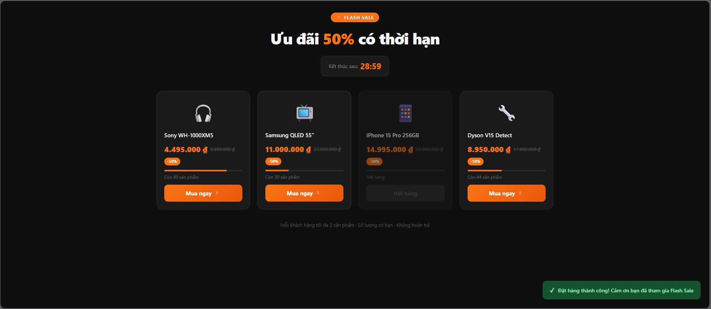

# Hệ Thống Flash Sale E-Commerce (Sapo Internship Exam)


*Minh hoạ giao diện săn siêu sale với Countdown timer và Stock Progress bar*

Đây là tài liệu mô tả nghiệp vụ triển khai hệ thống **Flash Sale** (Bán hàng chớp nhoáng) cho một Sàn Thương mại Điện tử, với khả năng xử lý đồng thời hàng chục ngàn lượt truy cập (CCU).

## ⚠️ Giải Quyết 3 Bài Toán Cốt Lõi (Core Problems)

Trong sự kiện Flash Sale, hệ thống luôn phải đối mặt với 3 thách thức lớn nhất mà Database truyền thống không thể gánh vác nổi. Dưới đây là cách dự án giải quyết từng bài toán:

### 1. Quá Tải Hệ Thống (Thundering Herd)
**Vấn đề:** 
10.000 người truy cập đồng loạt vào giây đầu tiên của Flash Sale khi năng lực hệ thống hiện tại chỉ chịu được 200 requests/s. Toàn bộ server sẽ bị treo (Timeout) hoặc Crash vì quá tải lượng lớn Connect tới Database và CPU.

**Giải Pháp:**
* **Bắt Caching (Redis) thay cho DB:** Ta lưu sẵn (preload) tồn kho của các sản phẩm Flash Sale vào Cache in-memory (Redis) ngay từ khi khởi động ứng dụng (`FlashSaleInitService`), thay vì Query trực tiếp vào MySQL/H2. Redis có tốc độ đọc ghi tính bằng micro-second (100,000 req/s), giúp bảo vệ Database khỏi hàng vạn request ập tới cùng lúc.
* **Cập nhật danh sách (Read Heavy):** API trả về danh sách sản phẩm chạy vòng lặp Read thẳng từ `STOCK_KEY` của Redis thay vì chờ DB (hàm `getActiveProducts`).

### 2. Bán Vượt Tồn Kho (Race Condition & Over-selling)
**Vấn đề:** 
Có 500 người cùng lúc vào trúng lúc sản phẩm chỉ còn số lượng 1. Do độ trễ (latency), cả 500 session đều nhận được logic điều kiện "tồn kho = 1 > 0" và cùng được hệ thống cho phép tạo Order. Hậu quả: Âm kho 499 sản phẩm.

**Giải Phấp Thực Tế Trong Code:**
* **Atomic Redis Decrement:** Sử dụng lệnh `redisTemplate.opsForValue().decrement(stockKey, quantity)` trong `FlashSaleService`. Đây là hành động "Nguyên tử" Single-thread đặc trưng của Redis. Chỉ có duy nhất 1 luồng được ưu tiên để trừ kho tại một thời điểm. Hàm này lập tức trả về giá trị kho *MỚI NHẤT* ngay sau khi trừ đi.
* **Check âm kho:** Nếu lệnh trừ trả về kết quả `< 0`, lập tức hoàn lại số lượng kho (Rollback) cộng vào lại, và ném lỗi `"Sản phẩm đã hết hàng"` về cho Front-End.
* **Database Row Lock (Secondary Defense):** Trong hàm `createOrder`, hệ thống dùng JPA `@Lock(LockModeType.PESSIMISTIC_WRITE)` dồn các request phải nối đuôi nhau đợi Lock nhả ra mới được phép Commit Data để Database không bị ghi đè dữ liệu lịch sử đặt hàng.

### 3. Vượt Quá Giới Hạn Mua / Người (Bypass Limit)
**Vấn đề:** 
Quy định mỗi khách chỉ mua 2 sản phẩm. Nếu khách dùng tool bắn liên tục 100 requests vào API. Backend kiểm tra bằng hàm SELECT count() từ Database không kịp phản hồi trạng thái hiện tại, và tool đó sẽ chốt lọt được hàng chục đơn.

**Giải Phấp Thực Tế Trong Code:**
* Áp dụng **Counter Token Bucket Pattern** dựa trên `Redis`.
* Đặt khóa gán cho từng người với từng món riêng biệt: `USER_LIMIT_KEY: {userId} : {productId}`.
* Khi API đến, hệ thống Atomic Increment số lượng mua lên. (`redisTemplate.opsForValue().increment()`). Lần mua đầu tiên, Key này được gán mốc sống là 24 Giờ.
* Nếu giá trị trả về sau Increment > 2 (Vượt quá số dư cho phép), API sẽ hoàn tác lại số đếm đó (`decrement` về như cũ) và chặn đứng luỵch xử lý từ chối giao dịch "Bạn đã mua đủ số lượng tối đa".

---

## ⚙️ Luồng Chạy API Trực Tiếp (Order Flow)

Cụ thể, End-point `POST /api/flash-sale/order` xử lý từng Event theo thứ tự khắt khe như sau (Chỉ cần 1 điều kiện fail là huỷ ngay lập tức):

1. **Validation Data:** Số lượng gửi lên có `> 0` không?
2. **Check Giới Hạn User (Redis):** Tiến hành `INCR` khoá `flash_sale:user_limit:1001:1`. Vượt? -> Báo Lỗi LIMIT.
3. **Trừ Tồn Kho Sinh Tử (Redis):** Tiến hành `DECR` khoá `flash_sale:stock:1`. Vượt 0 (Hết kho)? -> Phục hồi (DECR lại User Limit và INCR lại Stock) -> Báo Lỗi OUT_OF_STOCK.
4. **Transaction Lưu DB:** Mở `TransactionTemplate` (Khoá Lock SQL cho an toàn) -> Lấy dữ liệu sản phẩm mới nhất -> Tạo Mảng `Order` -> Lưu Log thành công -> Phản hồi kết quả có mã Đơn Hàng cho UI. Nếu quá trình này sập giữa chừng (do Lỗi mạng, mất điện, v.v..), hệ thống lập tức chui vào Catch Block và *Rollback* phục hồi nguyên trạng cả Kho & User Limit trong Redis.

---

## � Chạy Sản Phẩm Trải Nghiệm (Hướng dẫn chi tiết gốc)

**Backend:**
Chạy cổng Default `8080`.
```bash
# Terminal 1
cd flash-sale-backend
mvn spring-boot:run
```
Có đính kèm giao diện test API Docs URL: `http://localhost:8080/swagger-ui.html`

**Frontend (React JS):**
Phục vụ cổng mặc định `5173`.
```bash
# Terminal 2
cd flash-sale-frontend
npm install
npm run dev
```

(Yêu cầu máy bật sẵn tiến trình `Redis Server` 6379 để sử dụng Counter Atomic)
